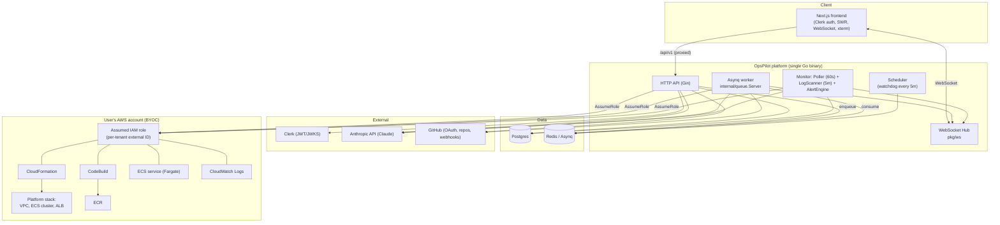
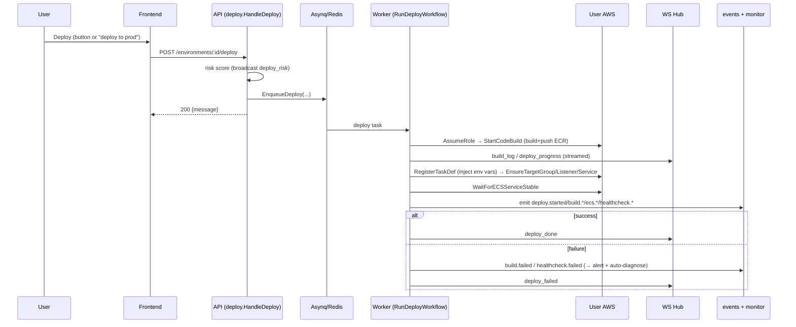
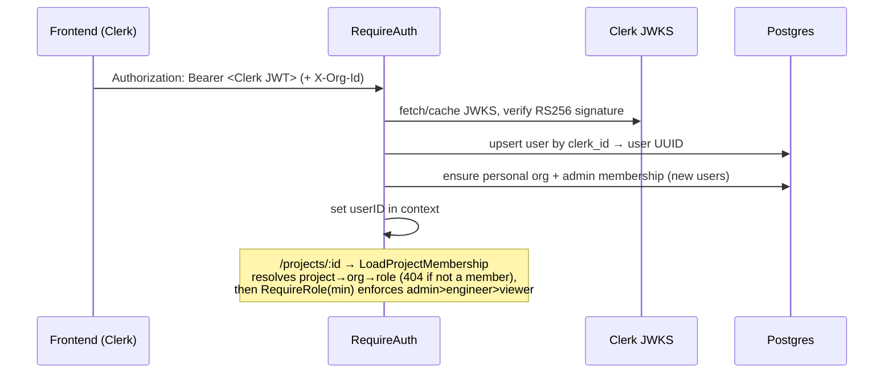
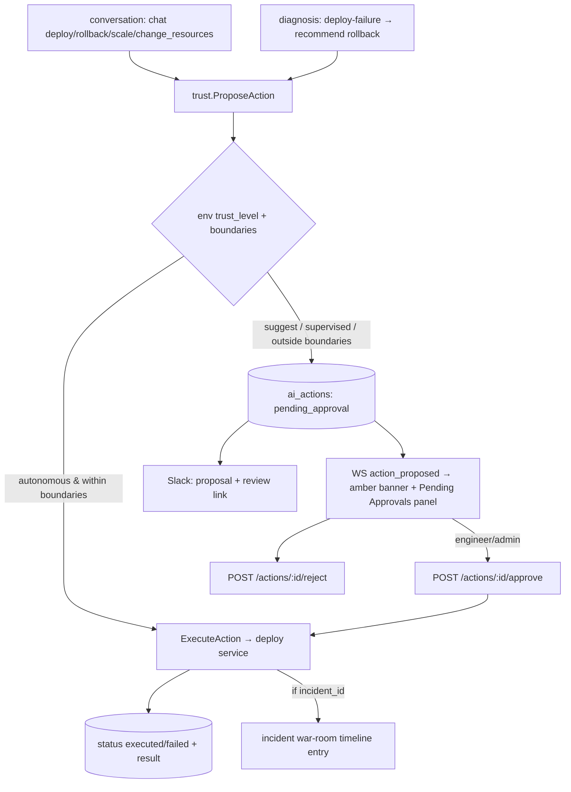
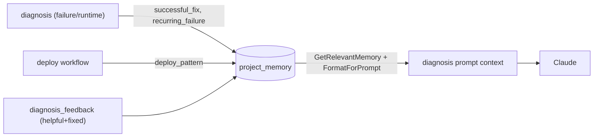
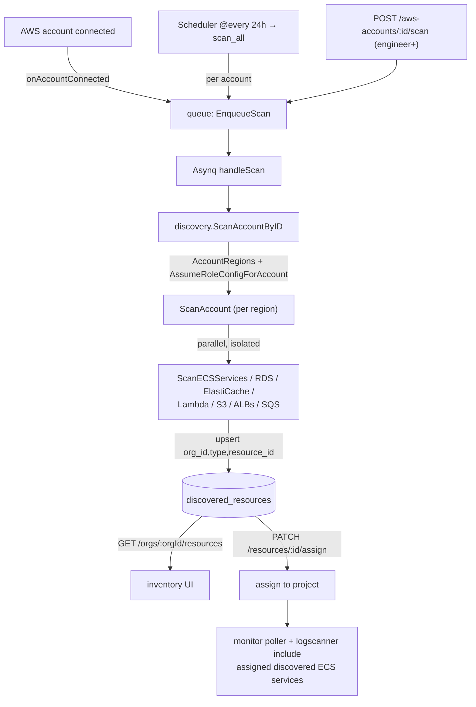
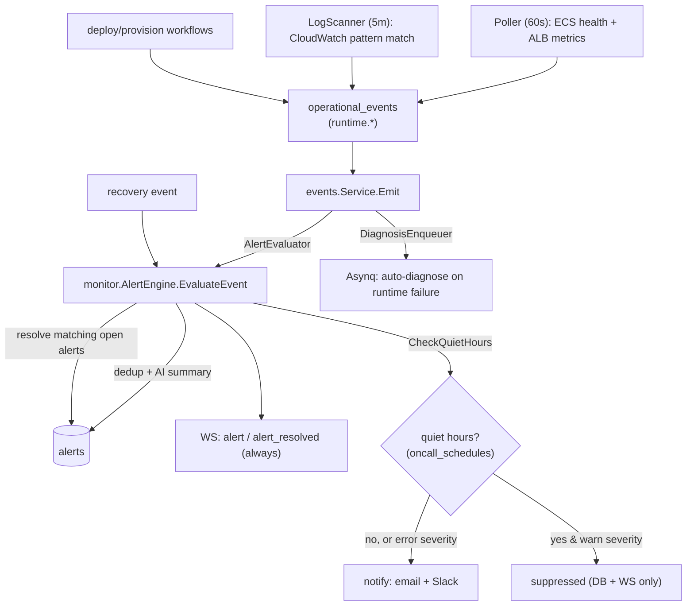
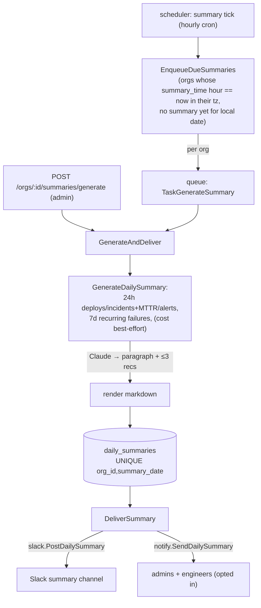
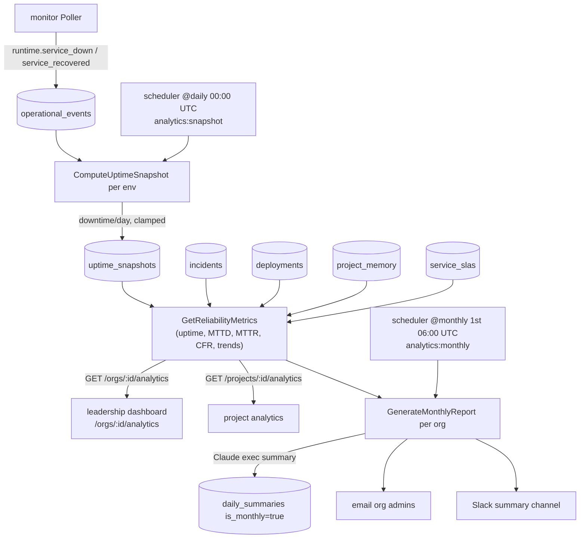

# Architecture — OpsPilot

## System overview

A Go monolith API + Asynq worker (same binary), a Next.js frontend, Postgres, and
Redis. All cloud mutations happen inside the **user's** AWS account via assumed IAM
roles. Claude (Anthropic API) is called only for intent classification, diagnosis,
and short natural-language summaries.



### Process model
Everything runs in one process started by `cmd/api/main.go`: the Gin HTTP server, the
WebSocket hub, the Asynq queue server (`go queueServer.Start()`), the watchdog
scheduler, the monitoring Poller, and the LogScanner. Horizontal scaling would split
the Asynq worker and monitors out, but today it's a single binary.

---

## Backend architecture

Domain-driven packages under `internal/`, each exposing a `Service`. `cmd/api/main.go`
is the composition root — it constructs every service once and injects dependencies
(including post-construction `Set*` calls to break cycles). See `BACKEND.md` for the
per-module reference.

Layering:
- **Transport:** Gin routes (`main.go`) + the WebSocket hub (`pkg/ws`).
- **Middleware** (`pkg/middleware`): RequestID → Proprietary → CORS globally; then
  `RequireAuth` and `RequireProjectOwnership` on protected groups; `RateLimiter` on
  expensive endpoints; `ApiKeyAuth` on admin exports.
- **Domain services** (`internal/*`): business logic, each with reusable
  context-taking methods + thin `Handle*` HTTP adapters.
- **Async:** `internal/queue` (Asynq) for deploy/provision/rollback/delete/diagnose +
  a Redis-backed pending-mutation store.
- **Persistence:** `pkg/models` (raw pgx, migrations-in-code).
- **Cloud:** `internal/aws` wraps STS/CloudFormation/ECS/ECR/CodeBuild/ELBv2/SSM/
  CloudWatch/Cost Explorer behind a per-request assumed-role `ClientBundle`.

---

## Frontend architecture

Next.js App Router (`frontend/app`). Clerk for auth, SWR for data fetching, raw
`WebSocket` for live streams, shadcn-style UI primitives, `xterm.js` for the terminal.
HTTP calls use relative `/api/v1/*` paths rewritten to the backend (no CORS);
WebSockets connect directly to the backend (`NEXT_PUBLIC_API_URL`). See `FRONTEND.md`.

---

## Data flow: a deploy



`HandleDeploy` enqueues only; `RunDeployWorkflow` (in `internal/deploy/service.go`)
does the work in the worker. Operational events emitted throughout are the substrate
for diagnosis, alerts, health and risk scores.

---

## Authentication flow



OpsPilot is multi-tenant via **organizations (team workspaces) + RBAC**. All tenant
data (`projects`, `aws_accounts`, `alerts`, `incidents`) belongs to an `org_id`; users
access it through `organization_members` with a role. See `DATABASE_SCHEMA.md` and
ADR-009.

- **Identity:** `RequireAuth` validates the Clerk JWT against cached JWKS and upserts
  the user. On first login it also creates the user's **personal organization** (admin
  membership); existing users were migrated by `backfillPersonalOrgs`.
- **Tenant isolation + roles** (`pkg/middleware/auth.go`):
  - `LoadProjectMembership(db)` on `/projects/:id/...` resolves the project's org and
    the caller's role (`db.ProjectOrgRole`), 404 for non-members, and stores
    `org_id`/`org_role` on the context.
  - `RequireRole(min...)` gates action routes by the hierarchy **admin(3) > engineer(2)
    > viewer(1)** — viewer = reads, engineer = deploy/rollback/scale/env-vars/alerts/
    chat/webhooks, admin = create/delete env, delete project, settings, AWS connect.
  - `RequireOrgMembership(db, roles...)` guards `/orgs/:orgId/...` (member management).
  - **Active org** for non-project routes (`/projects`, `/aws-accounts`) comes from the
    `X-Org-Id` header (`middleware.ActiveOrg`), defaulting to the personal org.
- **WebSocket:** first-message `{type:"auth", token}`; the hub's `AuthFunc` verifies
  **org membership** for the project (any role — viewers receive live broadcasts) then
  replies `auth_ok`. Action intents over chat are blocked for viewers inside
  `conversation.ProcessMessage` (the WS layer only checks membership).
- Admin export endpoints use a static `ADMIN_API_KEY` bearer instead of Clerk.

---

## AI conversation flow

```mermaid
sequenceDiagram
  participant U as User
  participant WS as WS Hub
  participant C as conversation.ProcessMessage
  participant B as billing (meter)
  participant LLM as Claude (intent classifier prompt)
  participant D as deploy / diagnosis (Go)

  U->>WS: { message: "scale to 3" }
  WS->>C: ProcessMessage(projectID,userID,msg)
  C->>B: IncrementAIAction (limit check)
  C->>C: prepend recent conversation context; save user msg
  C->>LLM: Complete(intentPrompt, msg) → JSON {intent, params}
  C->>D: switch(intent) → Go method executes (never the LLM)
  D-->>C: human-readable result
  C->>WS: response (persisted to conversations)
```

**Invariant:** Claude returns a structured intent + params; a Go `switch`
(`ProcessMessage`) routes to a real workflow. The LLM never calls AWS or the DB.
Destructive params are validated by Go and never guessed (e.g. missing replica count
→ ask, don't assume). On classifier failure the chat degrades to a helpful fallback
pointing at dashboard buttons.

---

## LLM integration

- One client: `internal/llm.Client.Complete(ctx, system, userMessage, maxTokens)` →
  Anthropic Messages API with retry/backoff on transient errors.
- Three call sites: **intent classification** (`conversation`), **diagnosis**
  (`diagnosis`, deploy-failure + runtime), and **short summaries** (alert summaries in
  `monitor.AlertEngine`, risk explanation in `deploy.explainRisk`).
- **Prompts are trade secrets** loaded at startup from env/file via `internal/prompts`
  (`MustLoad` panics if absent). The intent classifier and diagnosis prompts are never
  in source. Model defaults to the latest Claude (see `internal/llm`).
- Every LLM call has a degradation path; an AI outage never hard-fails a request.

### Explainability & confidence (ADR-012)
Every AI decision carries a "why". Three mechanisms:
- **Diagnosis** makes a *second* structured Claude call (`analyzeConfidenceEvidence`,
  max 500 tokens) returning a confidence (0–100 → stored 0.0–1.0 on `incidents.confidence_score`)
  and a JSONB **evidence** array on `incidents.evidence`. Each evidence item is
  `{type, description, data, weight}` where `type` ∈ `log_pattern | metric_spike |
  deploy_correlation | memory_match | similar_incident`. If the call fails, the diagnosis
  is still saved with `confidence=null, evidence=[]`. Chat appends a compact
  "Based on N signal(s) — confidence: X%" line; the dashboard/war room render a colored
  confidence badge + a collapsible evidence list (`components/ai/explainability.tsx`).
- **Alerts** carry `evidence_text` (1–2 sentences) built **deterministically** from the
  triggering operational-event payload (error rate, task counts, matched log pattern) —
  no LLM, so it's always present and accurate. Shown under the alert summary.
- **Risk scores** are already explainable: every `RiskFactor` has a `Reason`; `TopFactor`
  is the highest-points reason for compact display. The full factor list rides in the
  `deploy_risk` WebSocket payload.
- *Principle:* no AI output appears in the UI without at least one sentence of explanation.

---

## Trust levels & AI-action approval (ADR-013)

Every AI-*initiated* action passes through the trust layer (`internal/trust`) before it
can touch infrastructure. Direct human actions (the dashboard deploy button) bypass this.



- **Trust levels** (per environment): `suggest` (every AI action needs approval),
  `supervised` (same, surfaced prominently), `autonomous` (actions within
  `autonomous_boundaries` auto-execute; others need approval). **There is no `can_deploy`
  boundary — deploys always require approval**, even in autonomous mode.
- **`requiresApproval`** is a pure policy function: autonomous + boundary-permitted
  (rollback/scale-within-min/max/change_resources) ⇒ auto-execute; everything else ⇒
  pending approval. Every proposal is recorded in `ai_actions` with rationale + (for
  diagnosis-sourced ones) the diagnosis confidence.
- **Execution** routes by `action_type` to the deploy service (deploy/rollback/scale/
  change_resources; terminal_command is not auto-executable) and records
  `status`/`executed_at`/`result`; incident-linked actions post to the war-room timeline.
- **Approval** requires engineer/admin in the action's org (`ApproveAction` validates via
  `UserOrgRole`); rejection is recorded. Slack proposals link back to the app (Slack
  users aren't mapped to platform users, so role-checked approval happens in-app).
- **Seams** (no import cycles): `trust.Deployer` (deploy.Service), `trust.SlackActionNotifier`
  (slack.Service), `trust.IncidentPoster` (incidents.Service); conversation/diagnosis hold
  `*trust.Service` (trust imports neither).
- *Reconciliation:* `ai_actions` is the executable, trust-gated action record; the
  war-room `incident_actions` remains the advisory "suggested fix" surfaced in the room.

## Memory architecture



`internal/memory` stores long-lived facts about each project in `project_memory`
(types: `recurring_failure`, `successful_fix`, `deploy_pattern`, …). Near-duplicate
facts are merged by a normalized `contentKey` (incrementing `reference_count` instead
of inserting). `diagnosis.memorySection` calls `GetRelevantMemory` and
`FormatForPrompt`, injecting the top facts into the diagnosis prompt so the model gets
project-specific over time. This is the system's learning loop.

---

## Infrastructure discovery flow

Lets users onboard **existing** AWS infrastructure (not created by OpsPilot) without
migration. See `internal/discovery` and ADR-010.



Scanners run in parallel and are independent — one failing (missing IAM permission,
throttling) does not stop the others. Re-scans are idempotent (upsert keyed by
`org_id, resource_type, resource_id`), refreshing `last_seen_at`/metadata/tags without
disturbing the user's `project_id` assignment. Resources tagged `ManagedBy=OpsPilot`
are flagged `is_managed`. Discovered ECS services **assigned to a project** are pulled
into the monitor's worker set (health poll + log anomaly scan), so pre-existing services
get the same alerting as OpsPilot-created ones.

## Incident war room flow

A shared, real-time space where the team investigates an incident alongside the AI.
See `internal/incidents` and the war-room WebSocket below.

```mermaid
graph TB
  DIAG["diagnosis completes\n(deploy failure / runtime anomaly)"] -->|CreateIncident (dedup)| INC[(incidents)]
  INC -->|first entry = AI diagnosis| TL[(incident_timeline)]
  INC -->|suggested fix| ACT[(incident_actions)]
  subgraph WarRoom["/incidents/:id war room"]
    HUMAN["engineer posts update"] -->|POST /timeline| TL
    ACK["Acknowledge → investigating"] --> INC
    APPROVE["Approve/Reject AI action"] --> ACT
    RES["Mark Resolved"] -->|resolve| INC
    RES -->|enqueue Asynq job| Q["postmortem:generate"]
    Q -->|Claude, async| PM["postmortems (draft)\nSummary/Timeline/Root Cause/\nContributing/What Went Well/Action Items"]
    PM -->|RecordSuccessfulFix| MEM[(project_memory)]
    EDIT["editor: edit → Publish"] --> PM
  end
  TL & INC & ACT -->|hub.Broadcast(incidentID)| WS["war-room WebSocket\n/ws/incidents/:id"]
  WS --> SUB["all subscribers (live)"]
```

- **Incidents are first-class lifecycle objects:** `open → investigating → resolved`,
  with severity, who acknowledged/resolved, and an AI postmortem. They are created by the
  diagnosis pipeline via `incidents.CreateIncident` (deduplicated per deployment, or per
  environment for runtime anomalies), which posts the AI diagnosis as the **first timeline
  entry** and surfaces the suggested fix as a pending action.
- **War-room WebSocket** (`pkg/ws` incident rooms): the hub's room key generalizes from
  project ID to **any room ID**; `HandleIncidentUpgrade` registers a broadcast-only
  socket keyed by incident ID (auth = org membership of the incident). Every timeline
  entry / status / action change is broadcast to all subscribers. Engineers post updates
  over HTTP (`POST /incidents/:id/timeline`), not the socket.
- **Postmortem (async — ADR-014):** resolving an incident does **not** block on Claude.
  `HandleResolve` enqueues a `postmortem:generate` Asynq job and returns
  `{status:"resolved", postmortem_generating:true}` immediately. The worker
  (`internal/postmortem.GeneratePostmortem`) loads the timeline + diagnosis + AI actions +
  deployment + project memory, calls Claude for markdown with fixed sections
  (Summary / Timeline / Root Cause / Contributing Factors / What Went Well / Action Items),
  parses out structured action items, and upserts a **draft** row in `postmortems`
  (`ON CONFLICT(incident_id)` → idempotent). It also writes the resolution to
  `project_memory` as a `successful_fix` so future diagnoses learn from it, and mirrors the
  markdown back to `incidents.postmortem` for backward compatibility. The war room polls
  `GET /incidents/:id/postmortem` (404 `{generating:true}` until ready), then shows a
  preview; engineers edit it on `/postmortems/:id/edit` and **Publish** it to the org
  library (`/orgs/postmortems`). Export is markdown or print-ready HTML ("Save as PDF").
- Alert emails now link to the war room (`/incidents`) instead of the project page.

## Monitoring & alerting flow



`events.Service` is the hub: every `Emit` fans out to the AlertEngine (events →
deduplicated, AI-summarized alerts, with snooze + auto-resolve on recovery) and the
diagnosis enqueuer (runtime failures auto-trigger a diagnosis job). The two wiring seams
this depends on are set up in `main.go`: `eventSvc.SetDiagnosisEnqueuer(queueClient)` (so
runtime failures enqueue auto-diagnosis) and `go logScanner.Start()` (so CloudWatch log
anomalies emit events) — both confirmed wired as of 2026-06-16.

- **On-call quiet hours (ADR-016):** before emailing/Slacking, `notifyOwner` calls
  `CheckQuietHours(orgID)` (evaluates `oncall_schedules` in the org's timezone — quiet hours
  window, with overnight wrap, or a quiet weekday). During quiet hours, **warn**-severity
  alerts are suppressed from email + Slack (the `alerts` row and the `alert` WS broadcast
  still happen, so an engineer at their desk sees it), logged as
  `alert suppressed during quiet hours: <id>`. **Error**-severity alerts always break through
  (email + Slack), with `⚠️ Sent outside quiet hours due to error severity` appended to the
  Slack message. No schedule configured ⇒ never quiet (fail open). Configured at
  `/settings/organization`.

---

## Daily operational summary

An AI morning briefing per org (`internal/summary`), posted to Slack and emailed.



- **Scheduling:** an hourly cron tick (`TaskSummaryTick`) calls `EnqueueDueSummaries`,
  which fans out one `TaskGenerateSummary` per org whose configured `summary_time` hour
  matches the current hour **in the org's timezone** and has no summary for its local
  date yet (the `UNIQUE(org_id, summary_date)` upsert also guards races).
- **Generation:** `GenerateDailySummary` aggregates the last 24h (deploys by status,
  incidents + MTTR, alerts) + 7-day top recurring failures from project memory, asks
  Claude for a grounded paragraph + ≤3 recommendations (strict JSON, template fallback),
  renders markdown, and upserts `daily_summaries`. Cost-change is real (best-effort): a
  7d-vs-prior-7d Cost Explorer comparison via `aws.GetCostTotalForRange`, omitted from output
  when there's no connected account or no prior-period spend.
- **Delivery:** Slack (reuses `slack.PostDailySummary`) + email to admins/engineers who
  enabled notifications; `delivered_slack`/`delivered_email` flags recorded. Config
  (time/timezone/enabled) lives on the `organizations` row.
- *(Supersedes the simpler Slack-only daily digest from the Slack feature.)*

## Engineering leadership analytics (ADR-015)

`internal/analytics` computes the leadership/reliability view — SLA & uptime, MTTD/MTTR,
deploy success & change-failure rates, trends — and the monthly operational health report.



- **Uptime is computed from operational events, not external probes (ADR-015):** a daily
  job (`analytics:snapshot`) walks each environment's `runtime.service_down` /
  `runtime.service_recovered` events and writes one `uptime_snapshots` row per env per day
  (downtime clipped to the day; outages spanning midnight are split correctly). Idempotent
  per `(environment, snapshot_date)`, so it recomputes yesterday + today on each run.
- **`GetReliabilityMetrics(orgID, projectID?, days)`** aggregates snapshots (minutes-weighted
  uptime) plus incidents (MTTD = first error event → `acknowledged_at`; MTTR =
  `acknowledged_at` → `resolved_at`), deployments (success rate; change-failure rate =
  deploys with an incident opened within 30 min of completion), recurring-failure patterns
  from memory, and daily uptime / weekly incident trends. It also computes the previous
  equal-length window for trend arrows. SLA status (`meeting`/`at_risk`/`breached`) compares
  uptime to the configured `service_slas` target (default 99.9%).
- **Monthly report** (`analytics:monthly`, 1st of month, or `POST /orgs/:id/reports/generate`):
  reliability metrics + per-project breakdown + incident/postmortem/deploy counts + best-effort
  cost → Claude executive summary (factual, no fluff) → stored in `daily_summaries` with
  `is_monthly = true` → emailed to admins + posted to Slack. The report email links to
  `/orgs/:id/analytics`.
- **Seam:** `analytics.SlackPoster` (satisfied by `*slack.Service`, injected via `SetSlack`),
  matching the daily-summary pattern. Per-environment SLA targets are set in the project
  Settings tab (`PUT /projects/:id/environments/:envId/sla`).

## Slack integration

Per-org Slack workspace connection (`internal/slack`, ADR-011) for notifications and
slash commands. Talks to the Slack Web API over **raw HTTP** (no SDK).

```mermaid
graph TB
  subgraph Connect
    INSTALL["GET /orgs/:id/slack/install (admin)\n→ signed-state OAuth URL"] --> SLACKOAUTH["Slack OAuth consent"]
    SLACKOAUTH --> CB["GET /slack/callback\n(verify state) → store bot_token (encrypted)"]
    CB --> SI[(slack_integrations)]
  end
  ALERTS["monitor.notifyOwner"] -->|PostAlert| SI
  DEPLOY["deploy result"] -->|PostDeployResult| SI
  DAILY["scheduler 14:00 UTC"] -->|PostDailySummaries| SI
  SI -->|chat.postMessage (Bearer)| SLACK["Slack workspace"]
  SLACK -->|/opspilot| CMD["POST /slack/commands\n(verify X-Slack-Signature)"]
  CMD -->|status/incidents/help| SLACK
  CMD -->|deploy/rollback confirm| BTN["Approve button"]
  BTN --> INT["POST /slack/interactivity\n(verify signature) → deploySvc.TriggerDeploy"]
```

- **Notifications** (best-effort, never block the caller): alerts → `PostAlert`
  (color-coded, links to the war room); deploy results → `PostDeployResult`;
  morning digest → `PostDailySummary` (daily scheduler). All resolve the org's
  connected workspace + channel and no-op if absent.
- **Slash commands** (`/opspilot status|incidents|deploy|rollback|help`): the workspace
  maps to an org via `team_id`; responses are ephemeral except deploy/rollback
  **confirmations** (in-channel, Approve button → `/slack/interactivity` → deploy).
- **Trust:** OAuth uses an HMAC-signed `state` (org+user); commands/interactivity verify
  the `X-Slack-Signature` HMAC. Bot tokens are encrypted at rest (`pkg/crypto`).
- **Injection seams** (no import cycles): `deploy.SlackNotifier`,
  `monitor.SlackAlertNotifier`, `slack.Deployer`.

## External integrations

| Integration | Used for | Where |
|---|---|---|
| **Clerk** | User auth (JWT + JWKS), user profile (email) | `internal/auth`, `pkg/middleware/auth.go` |
| **Slack** | Per-org alert/deploy notifications, daily digest, `/opspilot` slash commands | `internal/slack` |
| **Anthropic (Claude)** | Intent classification, diagnosis, summaries | `internal/llm` |
| **GitHub** | OAuth, repo/branch list, framework detection, PR webhooks (previews) | `internal/github`, `deploy.HandleGithubWebhook` |
| **AWS (STS, CloudFormation, ECS, ECR, CodeBuild, ELBv2, SSM, CloudWatch, Cost Explorer)** | All infra in the user's account | `internal/aws` |
| **SMTP** | Alert + deploy-result emails (optional) | `internal/notify` |
| **Redis / Asynq** | Async jobs, watchdog schedule, pending mutations | `internal/queue` |
| **Postgres** | All persistent state | `pkg/models` |
