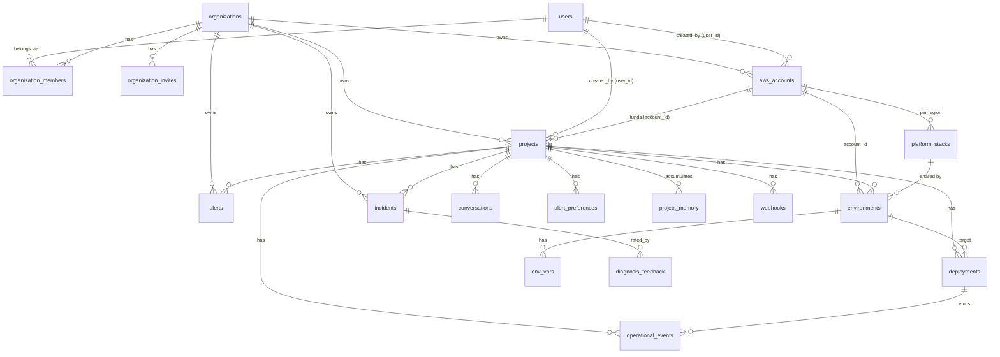

# Database Schema — OpsPilot

Postgres. Schema is defined as ordered, **idempotent** migration strings in
[`pkg/models/db.go`](../../pkg/models/db.go) (`RunMigrations`, run at startup) — there
is no separate migrations directory and no ORM. **Append new migrations to the bottom
of the slice; never edit a shipped migration.** Entity structs are in
[`pkg/models/types.go`](../../pkg/models/types.go). All PKs are `UUID DEFAULT gen_random_uuid()`.

## Entity relationships

## Tables

### `organizations` (team workspace)
The tenant boundary. All `projects`, `aws_accounts`, `alerts`, `incidents` belong to an
org. `slug` is URL-safe and unique; `created_by` references the founding user. Every
user gets a **personal org** on first login (slug `u-<userid>`), created by
`backfillPersonalOrgs` (existing users) or `ensurePersonalOrg` in the auth middleware
(new users). Added by `createOrganizationsTable`.

### `organization_members` (RBAC)
A user's `role` in an org: `admin` | `engineer` | `viewer` (CHECK-constrained,
hierarchical). `UNIQUE(org_id, user_id)`. This is the tenant-isolation primitive —
`db.UserOrgRole` and `db.ProjectOrgRole` join through it. `invited_by` tracks who added
the member. An org must always retain ≥1 admin (enforced in `internal/orgs`).

### `organization_invites`
Pending invitations, redeemable by `token` (UUID, unique-indexed). `email`, `role`,
`expires_at` (default NOW()+7 days), `accepted_at` (NULL until redeemed). On accept, a
membership row is created and `accepted_at` is set. Emailed via `notify.SendOrgInvite`.

### `users`
Identity, mirrored from Clerk on first authenticated request.
- `clerk_id` (unique), `email` (unique), `github_token` (**AES-encrypted**, `json:"-"`).
- Plan/usage/notifications (added later): `plan` (`free`/`pro`/`team`),
  `ai_actions_this_month`, `ai_actions_reset_at` (monthly metering),
  `notifications_enabled`, `notify_deploy_failed` (default true),
  `notify_deploy_succeeded` (default false), `notify_alert_fired` (default true).

### `aws_accounts`
A user's connected AWS account (BYOC). One user → many accounts.
- `aws_account_id`, `iam_role_arn` (role OpsPilot assumes), `label`.
- `external_id` (**per-tenant STS external ID**, `json:"-"`; legacy default `'convdeploy'`).
- `certificate_arn` (optional ACM cert → enables HTTPS on the shared ALB).
- Deletion: referenced by `operational_events.account_id` via `ON DELETE SET NULL` so
  the connect-time audit row doesn't pin the account in place.

### `projects`
A GitHub repo registered for deployment. Belongs to an **`org_id`** (tenant boundary);
`user_id` records the creator; optionally funded by an `account_id`. Access is via
`db.ProjectOrgRole` (org membership + role), not direct user ownership.

> **`org_id` columns** were added to `projects`, `aws_accounts`, `alerts`, and
> `incidents` by `addOrgIDColumns` (FK → `organizations`, `ON DELETE CASCADE`). They are
> backfilled for existing rows by `backfillPersonalOrgs` and always set by the
> application on insert (alerts/incidents via a `(SELECT org_id FROM projects …)`
> subselect). Listing/creating projects and AWS accounts is scoped to the **active org**
> (`X-Org-Id` header).
- `repo_url/owner/name`, `framework` (one of 18, see `ValidFramework`), `branch`,
  `start_command`.
- `github_webhook_id` + `github_webhook_secret` (`json:"-"`): set when PR previews are
  enabled; `previews_enabled` is derived (webhook id non-nil).

### `platform_stacks`
**Shared infrastructure provisioned once per `account_id × aws_region`** (VPC, ECS
cluster, ALB, security groups, subnets) and reused by every environment in that account
+region. `UNIQUE(account_id, aws_region)`.
- `stack_status`, `ecs_cluster_name`, `alb_arn/dns/listener_arn`, security groups,
  `subnet_ids` (comma-separated), `https_enabled` (true when provisioned with a cert →
  listener is 443 and app URLs use `https://`).

### `environments`
A deployment target for a project: `staging`, `production`, or a `pr-N` preview.
- Links: `project_id`, `account_id`, `platform_stack_id`.
- Project-level CF stack: `cloudformation_stack_id`, `stack_status`
  (`pending`/`provisioning`/`ready`/`failed`).
- Per-env resources: `ecr_repo_uri`, `ecs_service_name`, `codebuild_project_name`,
  `task_execution_role_arn`, `log_group_name`.
- Deploy-time (SDK-created) resources: `alb_target_group_arn`, `alb_listener_rule_arn`,
  `alb_dns`.
- Legacy single-stack fields (pre-platform-stack envs only): `ecs_cluster_name`,
  `ecs_security_group_id`, `vpc_subnets`.
- Preview fields (when `is_preview`): `pr_number`, `pr_branch`, `pr_head_sha`,
  `github_pr_comment_id`. Partial unique indexes: one non-preview name per project; one
  preview per PR number.

### `deployments`
One build+rollout of a commit to an environment.
- `commit_sha`, `commit_message`, `image_uri` (ECR), `build_id` (CodeBuild — enables
  cancel + log streaming), `status` (`pending`→`building`→`deploying`→`live` | `failed`
  | `rolled_back`), `failure_reason`.

### `env_vars`
Per-environment key/value injected into the ECS task definition at deploy time.
`UNIQUE(environment_id, key)`. `is_secret=true` → value redacted in API list responses
(revealed only via the dedicated reveal endpoint); stored plaintext (DB encrypted at rest).

### `operational_events`
**The AI substrate.** Structured record of every meaningful state transition (deploy/
provision lifecycle + `runtime.*` monitoring events). AI reasons over these rows, not
raw logs.
- `event_type`, `severity` (`info`/`warn`/`error`), `source` (`deployer`/`ecs`/`alb`/
  `build`/`scheduler`/`ai`), `actor_type` (`system`/`user`/`ai`), `payload` (JSONB).
- `project_id` nullable + optional `account_id` (account-scoped audit events like
  `external_id.generated` that predate any project). Indexed by deployment and by
  `(project_id, occurred_at DESC)`.

### `incidents`
A diagnosed problem. `trigger` = `deploy_failure` | `runtime_anomaly` | `user_request`.
Stores `root_cause`, `resolution`, `raw_logs` (`json:"-"`). Created by the diagnosis
service; rated via `diagnosis_feedback`.

### `diagnosis_feedback`
User rating of an AI diagnosis. `rating` (`helpful`/`not_helpful`/`partially_helpful`)
+ `fixed_issue`. `RatingScore()` → 1.0 (helpful+fixed) / 0.5 (partial) / 0.0.
`UNIQUE(incident_id, user_id)`. **`helpful + fixed_issue` rows are the gold-standard
training dataset** (exported via admin endpoints; feeds project memory).

### `alerts`
Deduplicated, user-facing notification derived from operational events by the alert
engine. `alert_type` (`service_down`/`tasks_degraded`/`high_error_rate`/`high_latency`/
`crash_loop`/`log_anomaly`/`deploy_stuck`), AI-generated `title`+`summary`, `status`
(`open`/`resolved`/`snoozed`), `triggered_at`/`resolved_at`/`snoozed_until`,
`source_event_ids` (UUID[]). Auto-resolved on a recovery event.

### `alert_preferences`
Per-environment, per-type snooze (`snoozed_until`). `UNIQUE(project_id, environment_id,
alert_type)`. The alert engine suppresses muted types.

### `project_memory`
**Long-term learning.** Facts about a project fed into diagnosis prompts.
`memory_type` (`recurring_failure`/`successful_fix`/`deploy_pattern`/`alert_preference`/
`infra_pattern`), `content`, `confidence`, `source` (`diagnosis`/`user_confirmed`/
`pattern_detected`), `reference_count` + `last_referenced_at` (near-duplicates merge by
normalized content key, incrementing the count instead of inserting).

### `conversations`
Chat history per project. `role` (`user`/`assistant`), `message`, classified `intent`,
`metadata` (JSONB). Source for the intent-classifier training export.

### `webhooks`
Outbound webhooks per project. `url`, `secret` (`json:"-"`, HMAC-SHA256), `events`
(`deploy.started/succeeded/failed`), `active`.

## Data lifecycle notes

- **Cascade:** deleting a user cascades to accounts, projects, and everything under
  them; deleting a project cascades to environments, deployments, conversations,
  events, alerts, memory, webhooks. Project deletion also enqueues
  `RunDeleteProjectCleanup` to tear down AWS resources asynchronously.
- **`account_id` on events** is `SET NULL` on account delete (preserve audit trail).
- **Metering reset:** `ai_actions_this_month` resets when `ai_actions_reset_at` rolls
  over a month (`billing.IncrementAIAction`).
- **Platform stack reuse:** environments never own a VPC/cluster/ALB directly once a
  `platform_stack_id` is set — they reference the shared stack.
