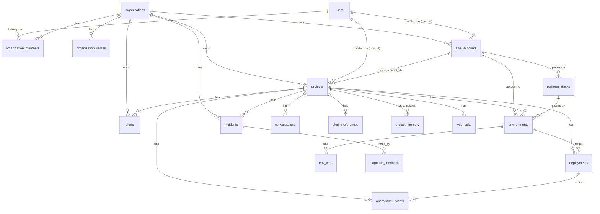

# Database Schema — OpsPilot

Postgres. Schema is defined as ordered, **idempotent** migration strings in
[`pkg/models/db.go`](../../pkg/models/db.go) (`RunMigrations`, run at startup) — there
is no separate migrations directory and no ORM. **Append new migrations to the bottom
of the slice; never edit a shipped migration.** Entity structs are in
[`pkg/models/types.go`](../../pkg/models/types.go). All PKs are `UUID DEFAULT gen_random_uuid()`.

## Entity relationships

## Tables

### `organizations` (team workspace)
The tenant boundary. All `projects`, `aws_accounts`, `alerts`, `incidents` belong to an
org. `slug` is URL-safe and unique; `created_by` references the founding user. Every
user gets a **personal org** on first login (slug `u-<userid>`), created by
`backfillPersonalOrgs` (existing users) or `ensurePersonalOrg` in the auth middleware
(new users). Added by `createOrganizationsTable`.

### `organization_members` (RBAC)
A user's `role` in an org: `admin` | `engineer` | `viewer` (CHECK-constrained,
hierarchical). `UNIQUE(org_id, user_id)`. This is the tenant-isolation primitive —
`db.UserOrgRole` and `db.ProjectOrgRole` join through it. `invited_by` tracks who added
the member. An org must always retain ≥1 admin (enforced in `internal/orgs`).

### `organization_invites`
Pending invitations, redeemable by `token` (UUID, unique-indexed). `email`, `role`,
`expires_at` (default NOW()+7 days), `accepted_at` (NULL until redeemed). On accept, a
membership row is created and `accepted_at` is set. Emailed via `notify.SendOrgInvite`.

### `users`
Identity, mirrored from Clerk on first authenticated request.
- `clerk_id` (unique), `email` (unique), `github_token` (**AES-encrypted**, `json:"-"`).
- Plan/usage/notifications (added later): `plan` (`free`/`pro`/`team`),
  `ai_actions_this_month`, `ai_actions_reset_at` (monthly metering),
  `notifications_enabled`, `notify_deploy_failed` (default true),
  `notify_deploy_succeeded` (default false), `notify_alert_fired` (default true).

### `aws_accounts`
A user's connected AWS account (BYOC). One user → many accounts.
- `aws_account_id`, `iam_role_arn` (role OpsPilot assumes), `label`.
- `external_id` (**per-tenant STS external ID**, `json:"-"`; legacy default `'convdeploy'`).
- `certificate_arn` (optional ACM cert → enables HTTPS on the shared ALB).
- Deletion: referenced by `operational_events.account_id` via `ON DELETE SET NULL` so
  the connect-time audit row doesn't pin the account in place.

### `projects`
A GitHub repo registered for deployment. Belongs to an **`org_id`** (tenant boundary);
`user_id` records the creator; optionally funded by an `account_id`. Access is via
`db.ProjectOrgRole` (org membership + role), not direct user ownership.

> **`org_id` columns** were added to `projects`, `aws_accounts`, `alerts`, and
> `incidents` by `addOrgIDColumns` (FK → `organizations`, `ON DELETE CASCADE`). They are
> backfilled for existing rows by `backfillPersonalOrgs` and always set by the
> application on insert (alerts/incidents via a `(SELECT org_id FROM projects …)`
> subselect). Listing/creating projects and AWS accounts is scoped to the **active org**
> (`X-Org-Id` header).
- `repo_url/owner/name`, `framework` (one of 18, see `ValidFramework`), `branch`,
  `start_command`.
- `github_webhook_id` + `github_webhook_secret` (`json:"-"`): set when PR previews are
  enabled; `previews_enabled` is derived (webhook id non-nil).

### `platform_stacks`
**Shared infrastructure provisioned once per `account_id × aws_region`** (VPC, ECS
cluster, ALB, security groups, subnets) and reused by every environment in that account
+region. `UNIQUE(account_id, aws_region)`.
- `stack_status`, `ecs_cluster_name`, `alb_arn/dns/listener_arn`, security groups,
  `subnet_ids` (comma-separated), `https_enabled` (true when provisioned with a cert →
  listener is 443 and app URLs use `https://`).

### `environments`
A deployment target for a project: `staging`, `production`, or a `pr-N` preview.
- Links: `project_id`, `account_id`, `platform_stack_id`.
- Project-level CF stack: `cloudformation_stack_id`, `stack_status`
  (`pending`/`provisioning`/`ready`/`failed`).
- Per-env resources: `ecr_repo_uri`, `ecs_service_name`, `codebuild_project_name`,
  `task_execution_role_arn`, `log_group_name`.
- Deploy-time (SDK-created) resources: `alb_target_group_arn`, `alb_listener_rule_arn`,
  `alb_dns`.
- Legacy single-stack fields (pre-platform-stack envs only): `ecs_cluster_name`,
  `ecs_security_group_id`, `vpc_subnets`.
- Preview fields (when `is_preview`): `pr_number`, `pr_branch`, `pr_head_sha`,
  `github_pr_comment_id`. Partial unique indexes: one non-preview name per project; one
  preview per PR number.

> **Trust columns on `environments`** (added by `addTrustLevelToEnvironments`):
> `trust_level` (`suggest`|`supervised`|`autonomous`, CHECK-constrained, default `suggest`)
> and `autonomous_boundaries` (JSONB: `{can_rollback, can_scale, min_replicas, max_replicas,
> can_change_resources}`) — govern whether AI-initiated actions auto-execute.

### `ai_actions`
Every AI-proposed action and its approval/execution lifecycle (the trust layer is the only
writer). Scoped to `org_id`/`project_id`/`environment_id`, optional `incident_id`.
`proposed_by_type` (`ai`|`human`) + nullable `proposed_by_user_id`; `action_type`
(`deploy`|`rollback`|`scale`|`change_resources`|`terminal_command`); `parameters` JSONB;
`confidence_score`; `rationale`; `status` (`pending_approval`→`approved`/`rejected`→
`executed`/`failed`); `approval_required`; `approved_by`; `proposed_at`/`decided_at`/
`executed_at`; `result` JSONB. Distinct from the war-room `incident_actions` (advisory
suggested-fixes) — this table is the executable, trust-gated record.

### `deployments`
One build+rollout of a commit to an environment.
- `commit_sha`, `commit_message`, `image_uri` (ECR), `build_id` (CodeBuild — enables
  cancel + log streaming), `status` (`pending`→`building`→`deploying`→`live` | `failed`
  | `rolled_back`), `failure_reason`.

### `env_vars`
Per-environment key/value injected into the ECS task definition at deploy time.
`UNIQUE(environment_id, key)`. `is_secret=true` → value redacted in API list responses
(revealed only via the dedicated reveal endpoint); stored plaintext (DB encrypted at rest).

### `operational_events`
**The AI substrate.** Structured record of every meaningful state transition (deploy/
provision lifecycle + `runtime.*` monitoring events). AI reasons over these rows, not
raw logs.
- `event_type`, `severity` (`info`/`warn`/`error`), `source` (`deployer`/`ecs`/`alb`/
  `build`/`scheduler`/`ai`), `actor_type` (`system`/`user`/`ai`), `payload` (JSONB).
- `project_id` nullable + optional `account_id` (account-scoped audit events like
  `external_id.generated` that predate any project). Indexed by deployment and by
  `(project_id, occurred_at DESC)`.

### `incidents`
A diagnosed problem and the unit of the **incident war room** (lifecycle-tracked).
`trigger` = `deploy_failure` | `runtime_anomaly` | `user_request`. Diagnosis fields:
`root_cause`, `resolution`, `raw_logs` (`json:"-"`). War-room fields (added by
`extendIncidentsForWarRoom`): `title`, `status` (`open`→`investigating`→`resolved`,
CHECK-constrained), `severity`, `acknowledged_by`/`acknowledged_at`,
`resolved_by`/`resolved_at`, `postmortem` (AI-generated markdown — now a backward-compat
mirror of the canonical `postmortems` row; see below), `org_id`.
Explainability (added by `addExplainabilityColumns`): `confidence_score` (FLOAT 0.0–1.0,
nullable) + `evidence` (JSONB array of `{type, description, data, weight}`, default `[]`),
populated by a second structured Claude call during diagnosis. Created by
`incidents.CreateIncident` from a completed diagnosis (deduplicated per deployment, or per
environment for runtime anomalies); rated via `diagnosis_feedback`.

### `incident_timeline`
The war-room feed: ordered AI + human posts as an incident is investigated.
`author_type` (`ai`/`human`), `author_id` (NULL for AI), `content` (markdown),
`entry_type` (`diagnosis`/`update`/`action_taken`/`resolution`), `metadata` JSONB. Every
insert is broadcast to the incident's war-room WebSocket. First entry of a new incident is
the AI diagnosis.

### `incident_actions`
Remediation steps proposed during an incident (by AI or human) with an approval
lifecycle. `proposed_by` (`ai`/`human`), `action_type`, `parameters` JSONB, `status`
(`pending`/`approved`/`executed`/`rejected`), `approved_by`, `executed_at`. The diagnosis's
suggested fix becomes a pending `suggested_fix` action; approve/reject are gated to
engineer+. (No autonomous executor yet — approval records the decision.)

### `postmortems`
Structured, editable, exportable postmortem for a resolved incident (created by
`createPostmortemsTable`). One per incident: `incident_id UUID UNIQUE` (FK, ON DELETE
CASCADE), plus `org_id`/`project_id` (FKs) for library scoping. `title`,
`status` (`draft`/`published`, CHECK-constrained), `content_markdown`, `action_items`
(JSONB array of `{item, owner, priority, due_date, status}`, default `[]`),
`generated_at`, `published_at`/`published_by`. Indexed `(org_id, status, created_at DESC)`
for the org library. Generated **asynchronously** by `internal/postmortem.GeneratePostmortem`
(an Asynq `postmortem:generate` job enqueued on resolve — ADR-014), which upserts
`ON CONFLICT(incident_id)` so retries are idempotent, mirrors the markdown to
`incidents.postmortem`, and writes the resolution to `project_memory` as a `successful_fix`.
Edited via PATCH, published (→ org library) by engineer+, exported as markdown or
print-ready HTML.

### `diagnosis_feedback`
User rating of an AI diagnosis. `rating` (`helpful`/`not_helpful`/`partially_helpful`)
+ `fixed_issue`. `RatingScore()` → 1.0 (helpful+fixed) / 0.5 (partial) / 0.0.
`UNIQUE(incident_id, user_id)`. **`helpful + fixed_issue` rows are the gold-standard
training dataset** (exported via admin endpoints; feeds project memory).

### `alerts`
Deduplicated, user-facing notification derived from operational events by the alert
engine. `alert_type` (`service_down`/`tasks_degraded`/`high_error_rate`/`high_latency`/
`crash_loop`/`log_anomaly`/`deploy_stuck`), AI-generated `title`+`summary`, and
`evidence_text` (1–2 sentences built deterministically from the triggering event payload —
the alert's explainability; added by `addExplainabilityColumns`). `status`
(`open`/`resolved`/`snoozed`), `triggered_at`/`resolved_at`/`snoozed_until`,
`source_event_ids` (UUID[]). Auto-resolved on a recovery event.

### `alert_preferences`
Per-environment, per-type snooze (`snoozed_until`). `UNIQUE(project_id, environment_id,
alert_type)`. The alert engine suppresses muted types.

### `project_memory`
**Long-term learning.** Facts about a project fed into diagnosis prompts.
`memory_type` (`recurring_failure`/`successful_fix`/`deploy_pattern`/`alert_preference`/
`infra_pattern`), `content`, `confidence`, `source` (`diagnosis`/`user_confirmed`/
`pattern_detected`), `reference_count` + `last_referenced_at` (near-duplicates merge by
normalized content key, incrementing the count instead of inserting).

### `discovered_resources`
AWS resources found by the discovery scanner (`internal/discovery`) in connected
accounts. Belongs to an `org_id` + `aws_account_id`. `resource_type` ∈ {`ecs_service`,
`ecs_cluster`, `rds_instance`, `elasticache_cluster`, `lambda_function`, `s3_bucket`,
`alb`, `cloudfront_distribution`, `sqs_queue`, `ec2_instance`}. `resource_id` is the AWS
ARN/native ID; `metadata` + `tags` are JSONB. `is_managed` = the resource carries the
`ManagedBy=OpsPilot` tag. `project_id` is NULL until a user assigns the resource to a
project (`ON DELETE SET NULL`). `first_seen_at`/`last_seen_at` bound its observation
window. **`UNIQUE(org_id, resource_type, resource_id)`** makes re-scans idempotent
(upsert). `aws_accounts` also gained **`last_scanned_at`** (UI "scanned Xm ago").

> ECS-service rows store `cluster_name`/`service_name`/`log_group_name` in `metadata`;
> the monitor reads those to poll + log-scan discovered services assigned to a project.

### `slack_integrations`
One Slack workspace connection per org (`UNIQUE(org_id)`). `team_id` maps incoming slash
commands back to the org; `bot_token` is **encrypted at rest** with ENCRYPTION_KEY
(`pkg/crypto`, never exposed in JSON). Per-purpose channel routing: `alert_channel_*`,
`deploy_channel_*`, `summary_channel_*` (id + name). `installed_by` records the admin who
connected it. Managed by `internal/slack` (OAuth callback writes it; the integrations UI
updates channels; disconnect deletes it).

### `daily_summaries`
One AI-generated morning briefing per org per day (`UNIQUE(org_id, summary_date)`).
`content_markdown` is the rendered briefing; `content_json` the structured metrics
(deploys, incidents+MTTR, alerts, top failures, recommendations). `delivered_slack` /
`delivered_email` track delivery. Written by `internal/summary` (idempotent upsert).
Delivery schedule lives on **`organizations`**: `summary_time` (TIME), `summary_timezone`
(IANA), `summary_enabled` (bool) — added by `addSummaryConfigToOrganizations`.

> **Monthly reports share this table** (`addMonthlyFlagToDailySummaries`): `is_monthly`
> (BOOL, default false) distinguishes the AI daily briefing (false) from the monthly
> operational health report (true, written by `internal/analytics`). The original
> `UNIQUE(org_id, summary_date)` was replaced with a unique index on
> `(org_id, summary_date, is_monthly)` so a monthly report and a daily summary can share a
> date; both upserts target that 3-column conflict.

### `service_slas`
Per-environment uptime SLA target for the analytics dashboard (`createServiceSLAsTable`).
`environment_id UNIQUE` (one SLA per env), with denormalized `org_id`/`project_id` for
scoped aggregation. `target_uptime_pct` (default **99.9**), `measurement_window_days`
(default 30). Set via the project Settings tab (`PUT /projects/:id/environments/:envId/sla`,
engineer+); read with a 99.9% default when unset.

### `uptime_snapshots`
One computed uptime row per environment per day (`createUptimeSnapshotsTable`), derived from
`runtime.service_down` / `runtime.service_recovered` operational events (ADR-015 — computed
from events, **not** external probes). `total_minutes`, `downtime_minutes`, `uptime_pct`,
`incident_count`. **`UNIQUE(environment_id, snapshot_date)`** makes the daily job idempotent
(upsert). Written by `analytics.ComputeUptimeSnapshot`; aggregated (minutes-weighted) into
the dashboard's reliability metrics and uptime trend.

### `conversations`
Chat history per project. `role` (`user`/`assistant`), `message`, classified `intent`,
`metadata` (JSONB). Source for the intent-classifier training export.

### `webhooks`
Outbound webhooks per project. `url`, `secret` (`json:"-"`, HMAC-SHA256), `events`
(`deploy.started/succeeded/failed`), `active`.

## Data lifecycle notes

- **Cascade:** deleting a user cascades to accounts, projects, and everything under
  them; deleting a project cascades to environments, deployments, conversations,
  events, alerts, memory, webhooks. Project deletion also enqueues
  `RunDeleteProjectCleanup` to tear down AWS resources asynchronously.
- **`account_id` on events** is `SET NULL` on account delete (preserve audit trail).
- **Metering reset:** `ai_actions_this_month` resets when `ai_actions_reset_at` rolls
  over a month (`billing.IncrementAIAction`).
- **Platform stack reuse:** environments never own a VPC/cluster/ALB directly once a
  `platform_stack_id` is set — they reference the shared stack.
